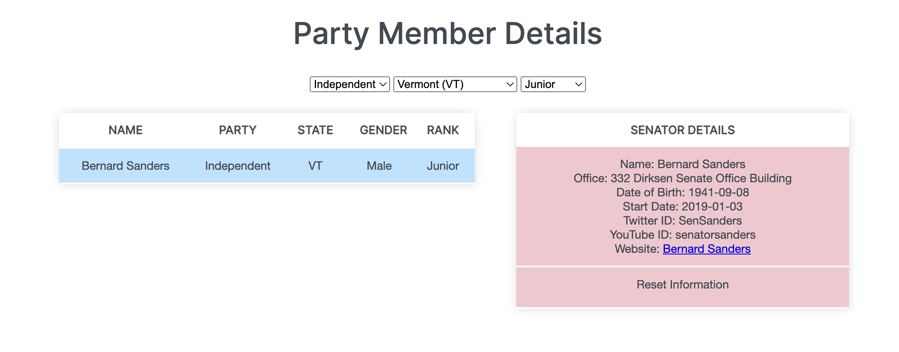

# US Senate - JavaScript & JSON (Web App Development Assignment)
The purpose of this web app is to present an overview of the US Senate by reading the required information exclusively from a JSON file. This assignment was completed as part of a two person Web App Development group project which received an A+ grade.

The deployment of the web app is available at the following link with screenshots displayed below:

* https://finbarallan.github.io/Web-App-Assignment/

## Description & Implementation
This web app functions by implementing a series of JavaScript functions to read the required JSON data and update the content of the HTML. The party affiliations and party leaders are determined by looping through the data and testing against a series of conditional statements which ensure the correct result is returned. 

The table is created by cycling through the data to create a HTML string which forms a table displaying the required information for each senator. Three onclick functions are added to the tables filter options which read the users input and filters the information from the HTML string to display only the information matching the users input. 

Additional information can be accessed by selecting the onclick function on each senators name which will update the contents of the senator details table. This function also implements error handling for cases in which a senators social media handle is unavailable.

## Languages, Frameworks & Technology

